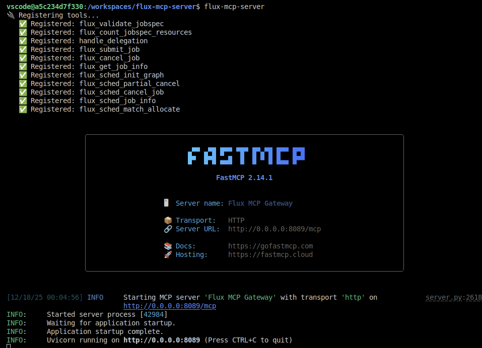
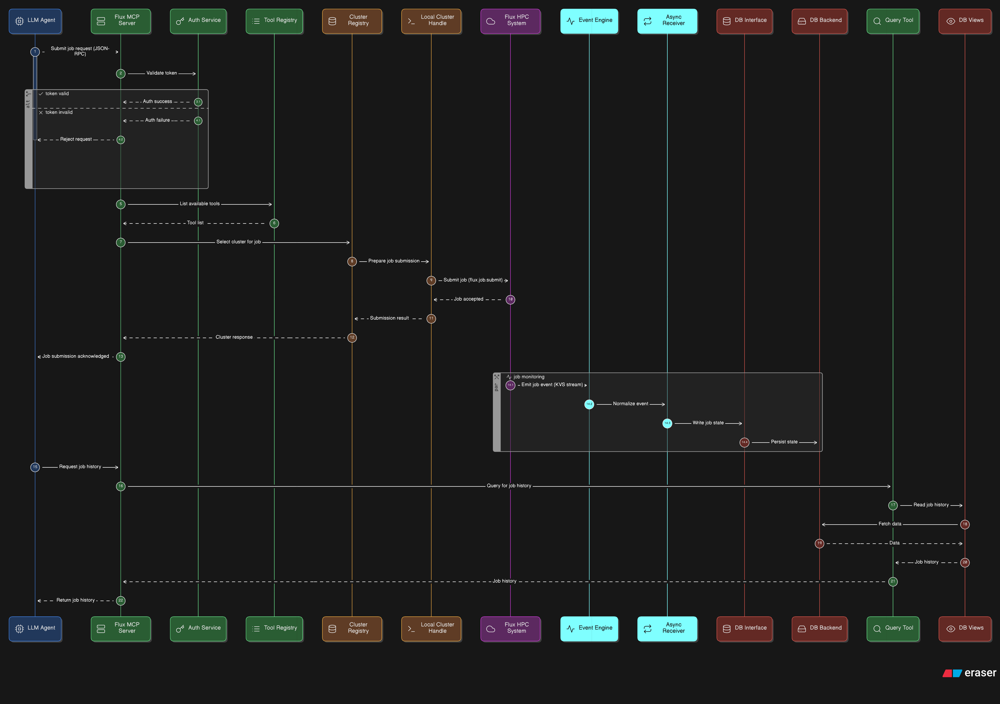

# flux-mcp server

> 🌀 Service to deploy functions for MCP tools for Flux Framework

This library uses [flux-mcp](https://github.com/converged-computing/flux-mcp)


See [design thinking](docs/design.md) for an overview of design.

## Usage

This server is currently expected to be deployed on a cluster, alongside a Flux instance.
This means you need flux-python (comes packaged with Flux, or `pip install flux-python==<version>`).

### Flux Instance

Let's mock a flux instance. Do a flux start in your terminal:

```bash
flux start
```

Get the `FLUX_URI` so we can connect from another terminal.

```bash
echo $FLUX_URI
```

You likely want to install the server to your local environment.

```bash
pip install -e . --break-system-packages
```

### Server

To start the server, we provide it with a configuration file with function definitions for Flux.

#### Without SSL

```bash
flux-mcp-server --config ./configs/mcpserver.yaml
# or
python3 -m flux_mcp_server.server --config ./configs/mcpserver.yaml
```




#### With SSL

To start with ssl, generate self-signed certificates (or production ones):

```bash
mkdir -p ./certs
openssl req -x509 -newkey rsa:4096 -keyout ./certs/key.pem -out ./certs/cert.pem -sha256 -days 365 -nodes -subj '/CN=localhost'

# This adds the equivalent of --ssl-keyfile and --ssl-certfile
flux-mcp-server --config ./configs/mcpserver-ssl.yaml
```

### Client

Next we can run a test that will submit a job, and then view the event (that was saved to our database).
In a different terminal, export the `$FLUX_URI` you saw above.

```bash
export FLUX_URI=local:///tmp/flux-aG87Ma/local-0
```

Now run the little demo. You can choose to use SSL or not depending on the config you used for the server. If you try to access `http` on the SSL server it will not work.

```bash
# With SSL
export SSL_CERT_DIR=$(pwd)/certs
export SSL_CERT_FILE=$(pwd)/certs/cert.pem
python3 ./tests/test_submit_ssl.py

# Without SSL
python3 ./tests/test_submit.py
```
```console
   ✅ Job ID: 359735320641536
⏳ Waiting for events to propagate to DB...
   found 1 events: {'submit'}
   found 7 events: {'start', 'submit', 'depend', 'alloc', 'priority', 'validate', 'annotations'}
   found 7 events: {'start', 'submit', 'depend', 'alloc', 'priority', 'validate', 'annotations'}
   found 11 events: {'start', 'submit', 'free', 'depend', 'finish', 'alloc', 'priority', 'validate', 'release', 'clean', 'annotations'}

📊 Event Log Analysis:
✅ Success! Recorded 11 events for Job 359735320641536.
   - [SUBMIT]
   - [VALIDATE]
   - [DEPEND]
   - [PRIORITY]
   - [ANNOTATIONS]
   - [ALLOC]
   - [START]
   - [FINISH]
   - [RELEASE]
   - [FREE]
   - [CLEAN]
```

If you accidentally kill the server (and the port is still alive):

```bash
kill $(lsof -t -i :8089)
```

### Development

```bash
apt-get install -y python3-build
pyproject-build
```



### Todo

- [x] Fastmcp endpoint serving Flux MCP functions
- [x] Handle should receive events and write to database
- [x] Database should be interface (and flexible to different ones)
  - sqlalchemy
- [ ] Auth should also be interface with different backends
  - Most basic is "none" that just uses the Flux handle.
  - Next is simple token, should be implemented as middleware of fastmcp
  - Then OAuth2
  - Then (custom) something with passing OAuth2-like to submit as a Flux user.
- [x] Example: user manually submits a job, can query database for state
- [ ] Example: Agent submits work, and can find state later.
- [x] Migrate to container, then Flux Operator / Kubernetes service.
- [ ] Tests in CI and automated build.

## License

HPCIC DevTools is distributed under the terms of the MIT license.
All new contributions must be made under this license.

See [LICENSE](https://github.com/converged-computing/cloud-select/blob/main/LICENSE),
[COPYRIGHT](https://github.com/converged-computing/cloud-select/blob/main/COPYRIGHT), and
[NOTICE](https://github.com/converged-computing/cloud-select/blob/main/NOTICE) for details.

SPDX-License-Identifier: (MIT)

LLNL-CODE- 842614
