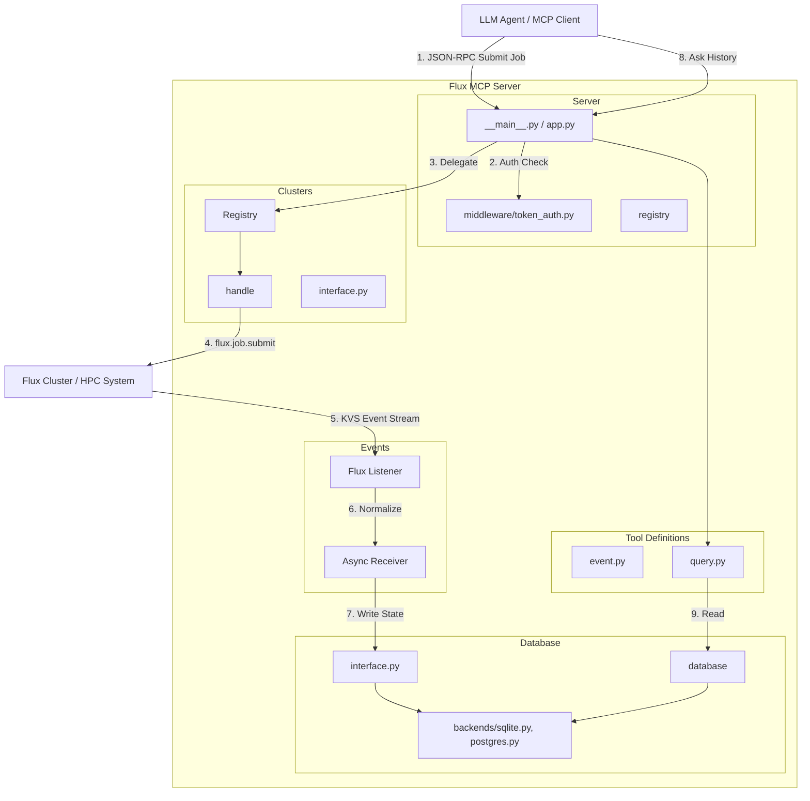

# Diagram

I'm not sure if this is a better (or even good) diagram so I'm putting it here. It's at least kind of neat.

```mermaid
graph TD
    %% Actors
    Client[LLM Agent / MCP Client]
    Flux[Flux Cluster / HPC System]

    %% The Flux MCP Server Application
    subgraph "Flux MCP Server"

        %% Entry Point
        subgraph "Server"
            Main[__main__.py / app.py]
            Auth[middleware/token_auth.py]
            ToolReg[registry]
        end

        %% The "Hands": Execution
        subgraph "Clusters"
            CReg[Registry]
            Local[handle]
            Interface[interface.py]
        end

        %% The "Eyes": Observability
        subgraph "Events"
            Engine[Flux Listener]
            Receiver[Async Receiver]
        end

        %% The "Memory": Persistence
        subgraph "Database"
            DB_Int[interface.py]
            Backends[backends/sqlite.py, postgres.py]
            Views[database]
        end

        %% The Interface
        subgraph "Tool Definitions"
            T_Event[event.py]
            T_Query[query.py]
        end
    end

    %% Flows
    Client -- "1. JSON-RPC Submit Job" --> Main
    Main -- "2. Auth Check" --> Auth
    Main -- "3. Delegate" --> CReg
    CReg --> Local
    Local -- "4. flux.job.submit" --> Flux

    Flux -- "5. KVS Event Stream" --> Engine
    Engine -- "6. Normalize" --> Receiver
    Receiver -- "7. Write State" --> DB_Int
    DB_Int --> Backends

    Client -- "8. Ask History" --> Main
    Main --> T_Query
    T_Query -- "9. Read" --> Views
    Views --> Backends
```
